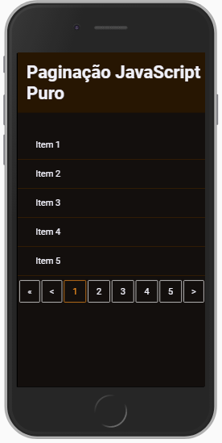
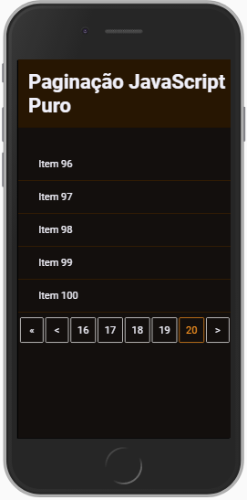
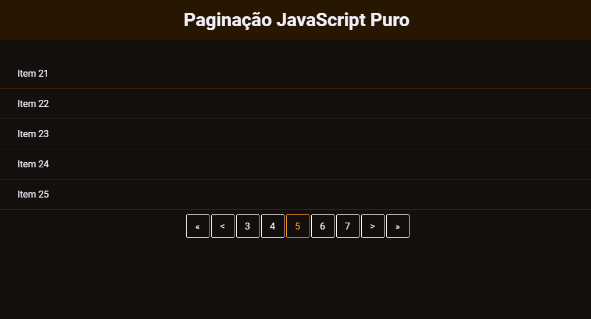

# Paginação JS Puro
# 📔 Sobre

Paginação no `FRONT END` com JS puro.

## Controle da Paginação: 

Feito o controle da paginação e as correções dos possíveis erros que possa acontecer.

Quando esta navegando pelos botões de paginação, o sistema verifica se a página solicitada é menor que a página 1. Se for, a varíavel página inicial, recebe o valor 1. Que é o valor da primeira página.

E da mesma forma quando é na última página. Se a página solicitada é maior do que o valor da última página. A varíavel pagina 

## 📱 Versão Mobile

---

## 💻 Web

---
<h1 align="center">💻 Desenvolvido Por: Gilberto Júnior</h1>